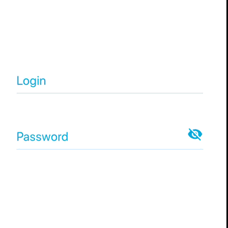
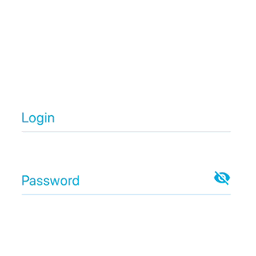

# react-native-KeyboardShift-razzium
A view (not a ScrollView !) component that handle keyboard display and prevent cover current focused input (based on John Tucker article : https://codeburst.io/react-native-keyboard-covering-inputs-72a9d3072689).",

 

## Installation

```bash
npm install react-native-KeyboardShift-razzium --save
or
yarn add react-native-KeyboardShift-razzium
```

## Usage

```javascript
import KeyboardShift from 'react-native-KeyboardShift-razzium';

// ...

render() {
    
  return (
    
     <KeyboardShift
        keyboardDisplayTopSpacing={10}
        animDuringKeyboardDisplayIOS={false} >
        {() => (
            <View style={styles.rootContainer}>
                <Text>
                react-native-KeyboardShift-razzium
                </Text>
            </View>
        )}
     </KeyboardShift>
            
  );
  
}
```

## Props

| Property | Type | isRequired? | Default | Description |
| --- | :---: | :---: | :---: | --- |
| `animDuringKeyboardDisplayIOS` | bool | optional | FALSE | Launch anim during keyboard display, not after display (iOS ONLY)|
| `keyboardShowDisplayDuration` | number | optional | 250 | Animation show during time |
| `keyboardHideDisplayDuration` | number | optional | 250 | Animation hide during time |
| `keyboardDisplayTopSpacing` | number | optional | 0 | Top spacing above keyboard (under input) |

## Credits
https://codeburst.io/react-native-keyboard-covering-inputs-72a9d3072689

## License
MIT